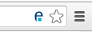
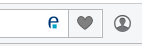
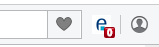

# Samples browser extensions
## Introduction
The purpose of this repository is to offer basic samples browser extensions.  
These browser extensions don't have practical real-world usage, they are meant to demonstrate how browser extension work through simple use-case. When building real-life browser extension, you most probably will combine these use-case with more complex code to answer your needs.

For the moment these samples have only been tested compatible with both Chrome and Opera browsers.

>__NOTE:__ There is no detailed explanation of how browser extensions works. If you want to know more about this, please refer to [Chrome][1] or [Opera][2] official documentation.

For instructions on how to test these extensions in your browser, please refer to either [Chrome][3] or [Opera][4] docs.

Lets watch these sample extension one-by-one from the simplest to the more complex one.  
Each extension is in its own folder which you can directly load into your browser.

## [0. Background](/0.background/)
You'll find here the most basic extension:
- a [`manifest.json`](/0.background/manifest.json) file defining your extension
- a background script ([`background.js`](/0.background/background.js) logging a `hello world` message

You should be able to see this `hello world` message by inspecting the _background page_ through a link in your browser's extension page (either [Chrome][5] or [Opera][6]).

## [1. Content script](/1.content_script/)
You'll see here that the [`manifest.json`](/1.content_script/manifest.json) file defines a script that is injected ([`content_script.js`](/1.content_script/content_script.js)) and an url pattern.  
When the url pattern is matched (basically by visiting [expertime's website][7]), the script is executed.

The injected content script ([`content_script.js`](/1.content_script/content_script.js)) itself does a few things:
- log a message in the _web page_'s console
- send a message to the _background page_:
```javascript
{'action': 'hello world'}
```
- declare a callback function that logs what it receives back from sending the message:
```javascript
msg => { console.log(msg); } // this is an 'arrow function'. It's the same thing as: function(msg) { console.log(msg); }
```

You'll see the _background page_'s script ([`background.js`](/1.content_script/background.js)) has a few changes too:
- it declares a `counter` variable
- it listens for any message that is passed,
- on receiving a message with `action == 'hello world'`, it:
    - increments the counter
    - logs the total number of visits (_i.e._ the counter's value)
    - calls back the callback function with the following message:
```javascript
{'counter': counter}
```

Hence, what happens every time you visit [expertime's website][7] is:
- the _web page_ logs a message in the console
- the _web page_ sends a message to the _background page_
- the _background page_ catches the message, increment its counter and log its value
- the _background page_ calls back the web page that logs the message

You'll see that as long as the browser isn't closed, that counter won't reinitialize.
This is because the _background page_ persists with the browser's lifetime.

## [2. Content script + event page](/2.content_script+event_page/)
The only difference between this extension and the previous one (except its name) is that the background page definition in the [`manifest.json`](/2.content_script+event_page/manifest.json) file has the following definition:
```javascript
"persistent": false // default value is true
```
This allows to transform the _background page_ into an _event page_.
 
The only difference it makes is that the _event page_ is allowed to be loaded only when it is needed, and to be unloaded when it goes idle. This is made to consume less memory.  
Therefore, if you visit a few times in a row [expertime's website][7], the _event page_ will behave the exact same way that the _background page_ did: the log will show an incrementing counter (1, 2, 3, 4, etc.).  
But if you wait __a few dozen seconds__ between each [expertime's website][7]'s page you visit, the _event page_ will go idle. Then, it (and its script) will be instanciated again... and the counter will be initialized, showing `1` each time.

This new sample extension showed you the difference between a regular _background page_ and an _event page_.
> __NOTE:__ Wether you are using a _background page_ or an _event page_, an internal variable is not a good way to store data. You should consider using the `browser.storage` API or an HTML5 storage API such as `localStorage`

## [3. Page action](/3.page_action/)
The [`content_script.js`](/3.page_action/content_script.js) is unchanged.

The [`manifest.json`](/3.page_action/manifest.json) file now defines a __page action__ with its logo and default title.
It will look like one of the following depending on your browser:  


>__NOTE:__ a __page action__ title is displayed in a _tooltip_ over the __page action__.  

On the other hand, the _background page_'s script ([`background.js`](/3.page_action/background.js)) presents a few changes:
- on receiving the message from the _web page_'s injected content script it also does:
    - show the __page action__ on the _web page_
    ```javascript
    browser.pageAction.show(sender.tab.id);
    ```
    - set the __page action__'s title with a message that shows the counter's value
    ```javascript
    browser.pageAction.setTitle({
            title: `counter: ${counter}`,   // set the title
            tabId: sender.tab.id            // on the tab that did send this message
        });
    ```
- it also define a script that will be executed each time a __page action__ is clicked:
    - this script resets the counter to zero, logs it, and update that __page action__'s title that was clicked
    - other _web page_'s page actions title won't be changed

In a nutshell, if you open two tabs on [expertime's website][7], you'll see a __page action__ on each, each having its own counter value on their respective title.  
You'll also see that by clicking on the __page action__ on one tab, the other tab's __page action__ is not affected.  
Finally, when visiting a new page on [expertime's website][7] again, you'll see that the global counter was indeed reset.

This illustrates both the fact that a __page action__ exists in multiple instances (each linked to a single _web page_), as well as the total independance of each _web page_'s __page action__.

## [4. Browser Action](/4.browser_action/)
The [`content_script.js`](/4.browser_action/content_script.js) is unchanged.

The [`manifest.json`](/4.browser_action/manifest.json) file now defines a __browser action__ instead of a __page action__.
It will look like one of the following depending on your browser:  



The _background page_'s script ([`background.js`](/4.browser_action/background.js)) adds one function compared to its [initial version](/1.content_script/background.js) in 1.content_script:
```javascript
function updateBadge(text) {
    browser.browserAction.setBadgeText({text: `${text}`}); // don't know dollar + mustache and back-tick syntax ? search 'template literal' or 'template string' 
}
```
What it does is updating the __browser action__'s badge text (the little red text on it).  
This function is called twice: when the background script is first loaded (both at install and browser startup), and each time the _web page_'s injected content script sends a message.  
The text of the __browser action__'s badge is set to the counter's value.

This extension allows you to understand the big difference with the __page action__: the __browser action__ does not depend on a _web page_.  
Furthermore, it is always shown (no _show()_ function has been executed) and exists in only one instance.

## [5. Browser Action + popup](/5.browser_action+popup/)
The [`content_script.js`](/4.browser_action/content_script.js) is unchanged.

The [`manifest.json`](/4.browser_action/manifest.json) file now defines a `default_popup` property for the __browser action__ which is set to a new html file: [`popup.html`](/4.browser_action/popup.html). This __popup__ is shown by clicking on the __browser action__'s icon.

The [`popup.html`](/4.browser_action/popup.html) file contains two html elements (a button and a span) and references a [`popup.js`](/4.browser_action/popup.js) script
> __IMPORTANT:__ inline javascript will never be executed.
  
What this script does is:
1. setting the `span`'s innerText to the `myinteger` variable. To prove that a new instance of the _popup page_ is created each time it is shown, the `myinteger` variable is set to 0 if  `undefined`, and incremented otherwise.
2. setting an onclick event handler on the `button`. The function called will send a message to the _background page_ the same way the _content script_ does, except the message is different:
```javascript
{'action': 'reset_counter'}
```

Hence, when the _background page_'s script ([`background.js`](/4.browser_action/background.js)) now catches the new message sent from the _popup page_, it interprets it by:
- setting the counter to zero
- logging it
- updating the __browser action__'s badge

This extension allows you to understand how a __popup__ works and can be used.  
Since the `span`'s inner text always shows `0` (no matter how many times you open it), it also proves that a new instance of the _ __popup__ page_ is created every time it is opened.

## 6. Conclusion
The list of possible extensions presented here is not limitative.  
You can do many other things that are not described here as well as mix concepts that have been introduced.  
These are just basic sample browser extensions.

> __IMPORTANT:__ There is nevertheless an important limitation that you must keep in mind: a browser extension can not have both a __browser action__ and a __page action__.

#License
[MIT](/LICENSE)

[1]: https://developer.chrome.com/extensions/
[2]: https://dev.opera.com/extensions/
[3]: https://developer.chrome.com/extensions/getstarted#unpacked
[4]: https://dev.opera.com/extensions/testing/
[5]: chrome://extensions
[6]: opera://extensions
[7]: http://www.expertime.com/